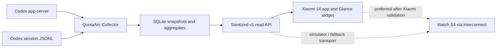

# QuotaArc development plan

Date: 2026-07-19

## Product objective

Deliver a trustworthy, glanceable view of Codex quota and usage on a Xiaomi 14
and Xiaomi Watch S4, without placing Codex credentials on either device.

The first usable release is:

- a local Collector on the Mac running Codex;
- an Android app and responsive Glance widget;
- official quota/reset information;
- official daily account Token activity when available;
- local day/model/project usage estimates;
- cached data, source status, freshness, and manual refresh;
- a Watch S4 Vela simulator app;
- a real Watch S4 build only after the Xiaomi access gate is passed.

## Non-goals for v1

- converting local Tokens into a presumed subscription quota unit;
- calling private ChatGPT web endpoints;
- exposing arbitrary app-server JSON-RPC;
- showing prompts or local filesystem paths on mobile devices;
- continuous watch background polling;
- watch-face complications or system cards;
- OpenAI API organization billing;
- multiple AI providers.

These can be reconsidered after the Codex-only data model is stable.

## Architecture



### Collector modules

1. `codex-rpc`
   - starts and supervises one app-server process;
   - performs the initialize/initialized handshake;
   - reads rate limits and account usage;
   - handles timeouts, process exit, login loss, and Codex upgrades.

2. `session-indexer`
   - scans active and archived JSONL;
   - resumes from byte offsets when safe;
   - extracts only metadata and Token events;
   - never persists prompts or messages;
   - handles forks, replay, truncation, replacement, and archive moves.

3. `usage-store`
   - stores file cursors, normalized events, quota snapshots, and aggregates;
   - records parser version and source provenance;
   - supports rebuilds without touching Codex source files.

4. `snapshot-service`
   - merges official quota, official aggregate activity, and local estimates;
   - computes freshness and diagnostics;
   - computes quota trend only from official quota samples.

5. `device-api`
   - returns a small versioned read model;
   - enforces read-only device credentials and refresh throttling;
   - redacts absolute paths and account secrets.

### Initial implementation choice

Use TypeScript on the installed Node.js runtime for the Collector MVP. Keep the
scanner and normalizer as dependency-light pure modules and benchmark them
against the current approximately 496 MiB corpus.

Do not move the scanner to Rust pre-emptively. Reconsider only if the measured
cold or warm performance misses the acceptance targets below.

The SQLite driver and final executable packaging method will be selected during
the Phase 0 packaging spike; this avoids locking the project to a native module
that cannot be shipped cleanly.

## Repository layout

```text
QuotaArc/
├── apps/
│   ├── android/
│   │   ├── app/
│   │   ├── widget/
│   │   └── data/
│   └── watch-vela/
│       ├── manifest.json
│       └── src/
├── services/
│   └── collector/
│       ├── src/
│       │   ├── codex-rpc/
│       │   ├── session-indexer/
│       │   ├── store/
│       │   ├── api/
│       │   └── diagnostics/
│       └── test/
├── packages/
│   └── contracts/
│       ├── schema/
│       └── examples/
└── docs/
```

## v1 data contract

The contract must make provenance explicit:

```json
{
  "schemaVersion": 1,
  "generatedAt": "ISO-8601",
  "stale": false,
  "sources": {
    "quota": {
      "kind": "codex_app_server",
      "status": "ok",
      "collectedAt": "ISO-8601"
    },
    "accountUsage": {
      "kind": "codex_app_server",
      "status": "ok",
      "collectedAt": "ISO-8601"
    },
    "localUsage": {
      "kind": "codex_session_logs",
      "status": "ok",
      "coverage": {
        "files": 0,
        "firstEventAt": "ISO-8601",
        "lastEventAt": "ISO-8601"
      }
    }
  },
  "quota": {
    "limits": [
      {
        "limitId": "opaque",
        "limitName": null,
        "windows": [
          {
            "windowMinutes": 10080,
            "usedPercent": 19,
            "remainingPercent": 81,
            "resetsAt": "ISO-8601"
          }
        ]
      }
    ]
  },
  "accountUsage": {
    "dailyTokens": []
  },
  "localUsage": {
    "period": "today",
    "newInputTokens": 0,
    "cachedInputTokens": 0,
    "outputTokens": 0,
    "reasoningTokens": 0,
    "models": [],
    "projects": []
  }
}
```

The example values are illustrative. Contract tests will use sanitized
fixtures, not current personal account values.

Planned endpoints:

```text
GET  /v1/health
GET  /v1/summary
GET  /v1/usage?period=today|week|month&groupBy=model|project|day
POST /v1/refresh
```

`POST /v1/refresh` queues or coalesces a refresh; it does not proxy arbitrary
Codex methods.

## Session index design

Persist at least:

```text
path
device_id + inode
mtime_ns
size
byte_offset
parser_version
thread_id
parent_thread_id
turn_id
current_model
current_cwd_alias
last_absolute_token_counters
counter_segment
```

Event identity will include:

```text
thread_id + turn_id + event_index + timestamp + token fingerprint
```

Required cases:

- append-only continuation;
- incomplete final line;
- active file moved to archived storage;
- same path replaced with a new inode;
- file truncation;
- parser upgrade invalidating cached state;
- parent history copied into a fork/subagent;
- multiple model or lineage counters interleaved;
- absolute counters decreasing after a reset/compaction;
- older rows without newer optional fields;
- provider `custom` separated from OpenAI account usage.

Project identity:

1. take the effective `turn_context.cwd`, falling back to session `cwd`;
2. detect Codex-managed worktrees;
3. resolve a Git worktree to its main repository when possible;
4. store a canonical private path locally;
5. return only a configured alias or safe basename to clients.

## Forecasting

Quota forecasting will use only official rate-limit samples belonging to the
same:

```text
limitId + windowDurationMins + resetsAt segment
```

Rules:

- require at least three samples over at least 20 minutes;
- reject samples spanning a reset or backend bucket change;
- use a robust slope over recent samples;
- report a range and confidence, not a precise promise;
- suppress the forecast when usage is flat, stale, or inconsistent;
- keep Token-per-day forecasts separate from quota forecasts.

## Delivery phases

Effort below is an engineering sequence estimate, not a release-date promise.
Watch access can extend elapsed time independently.

### Phase 0 — repository and capability spikes

Estimate: 1–2 engineering days

Work:

- create the monorepo toolchain and continuous checks;
- add sanitized app-server response fixtures;
- add session fixtures for all locally observed field variants;
- prove a packaged Collector can start on this Mac;
- install and verify Android Studio/JDK/SDK/ADB;
- install and verify AIoT-IDE and the 466×466 simulator;
- ask Xiaomi for Watch S4 partner debugging access;
- run a transport spike from Mac to Xiaomi 14;
- record an architecture decision for the production transport.

Exit criteria:

- one command runs Collector tests;
- a probe prints a normalized quota snapshot without secrets;
- a probe prints normalized local usage from fixtures;
- Android and Vela hello-world builds succeed;
- unresolved Watch access is recorded as a visible release gate.

### Phase 1 — Collector core

Estimate: 4–6 engineering days

Work:

- app-server process supervisor and request correlation;
- `account/rateLimits/read` normalization;
- optional `account/usage/read` normalization;
- session scanner, cursor store, and SQLite schema;
- model/day/project aggregation;
- source status, caching, and stale behavior;
- sanitized local HTTP API;
- unit, fixture, and integration tests.

Performance targets on the current Mac:

- cold index of the current approximately 496 MiB corpus: at most 30 seconds;
- warm scan with no changes: at most 500 ms;
- appended-data scan reads only the new portion in the normal case;
- peak Collector memory during cold indexing: at most 250 MiB;
- API response from cached state: p95 below 100 ms.

Correctness exit criteria:

- repeated scans do not change totals;
- an archive move does not double-count;
- a truncated/replaced file rebuilds safely;
- counter decreases start a new segment without negative usage;
- replay/fork fixtures do not double-count copied history;
- missing account usage degrades without losing quota or local estimates;
- app-server restart and timeout preserve the last good snapshot;
- no test or API response contains prompt text or an absolute project path.

### Phase 2 — Xiaomi 14 app and widget

Estimate: 4–6 engineering days

Work:

- Android data client and persistent last-good snapshot;
- setup screen for Collector connection;
- responsive Glance widget;
- detail activity for limits, models, projects, and source diagnostics;
- WorkManager sync;
- manual refresh with request coalescing;
- offline, stale, and authentication states;
- widget accessibility and dark/light appearance.

Widget variants:

- compact: lowest remaining quota, reset time, freshness;
- medium: all current limit buckets plus today's local activity;
- detail activity: source-separated charts and diagnostics.

Exit criteria:

- works on a Xiaomi 14, not just an emulator;
- survives reboot, app force-stop recovery, network loss, and Collector restart;
- layout survives widget resize and HyperOS cropping;
- no minute-level background refresh loop;
- manual refresh visibly reports success, stale fallback, or error;
- an overnight HyperOS/Doze sample records actual refresh behavior.

### Phase 3 — Watch S4 simulator app

Estimate: 3–4 engineering days

Work:

- Vela app structure and signed development package;
- 466×466 safe-area layout;
- quota arc and reset/freshness text;
- summary and detail pages;
- `system.fetch` client for simulator/dev transport;
- `system.storage` last-good cache;
- `onShow` refresh deduplication and manual refresh;
- offline, stale, loading, and malformed-response states.

Exit criteria:

- first meaningful screen appears within two seconds in the simulator;
- all important text remains inside the circular safe area;
- repeated screen wakes do not cause request storms;
- cached data remains readable when the Collector is unavailable;
- the app never displays or stores a Codex credential.

### Phase 4 — Watch real device and phone interconnect

Estimate: 3–6 engineering days after access is granted

Entry gates:

- Xiaomi partner debugging access;
- required Watch S4 OTA and beta Xiaomi Wear app;
- confirmed package-name/signature rules;
- confirmed third-party installation or release channel.

Work:

- run Xiaomi's official minimal interconnect demo;
- freeze Android/Vela application ID and signing plan;
- send sanitized snapshots from phone to watch;
- validate reconnection, phone-not-installed, and disconnect states;
- measure real-device startup, request latency, and battery behavior;
- produce and verify a release RPK.

Exit criteria:

- real Watch S4 installation and launch are demonstrated;
- paired-phone transfer is verified after reconnect and reboot;
- no long-lived Collector credential is stored on the watch;
- real-device behavior matches the documented simulator states;
- release-channel limitations are documented honestly.

If the entry gates remain unavailable, Phase 4 stays blocked without blocking
the Collector, Android release, or Watch simulator artifact.

### Phase 5 — hardening and first release

Estimate: 2–4 engineering days

Work:

- final transport security;
- read-only device token creation, revocation, and rotation;
- rate limiting and refresh coalescing;
- Collector background-service packaging;
- schema migration and backup/restore tests;
- privacy review and dependency/license notices;
- install, upgrade, rollback, and troubleshooting documentation;
- release artifacts and checksums.

Exit criteria:

- a clean-machine install guide is exercised;
- upgrade preserves the usage database and device configuration;
- device revocation is tested;
- security tests show no arbitrary RPC, secret, prompt, or path exposure;
- release status clearly distinguishes Android-ready, Watch-simulator-ready,
  and Watch-real-device-ready.

## Production transport decision

The Collector defaults to loopback. A production mobile path is not selected
until Phase 0 proves it.

Candidate order:

1. Android app reaches a protected Collector endpoint; Android forwards the
   sanitized snapshot to Watch via interconnect.
2. If interconnect access is unavailable, use a minimal sanitized relay with
   end-to-end authenticated snapshots.
3. Direct Watch-to-Collector access is a development/simulator fallback, not
   the preferred release design.

Do not expose an unauthenticated app-server WebSocket or raw LAN HTTP endpoint.

## Test strategy

### Collector

- schema/normalization tests for optional and unknown fields;
- golden fixtures from Codex versions 0.141–0.145;
- property tests for non-negative Token deltas;
- replay, fork, archive, truncate, replace, and partial-line tests;
- restart and stale-cache integration tests;
- performance test against generated large files and the local corpus;
- API contract and redaction tests.

### Android

- repository and serialization tests;
- widget rendering tests for supported sizes;
- WorkManager tests;
- offline/stale/manual-refresh tests;
- Xiaomi 14 tests for reboot, Doze, battery saver, and process death.

### Watch

- 466×466 screenshot checks;
- safe-area and large-number formatting tests;
- request throttling and cached fallback tests;
- malformed JSON and clock-skew tests;
- real-device tests only after the access gate.

## Main risks and mitigations

| Risk | Impact | Mitigation |
|---|---|---|
| Codex app-server schema changes | Collector loses official data | Version detection, stable-surface fixtures, capability probes, last-good cache |
| Local JSONL changes or missing events | Local estimates incomplete | Lenient parser, coverage diagnostics, parser versions, no “official bill” label |
| Fork/replay double-counting | Inflated usage | Thread/turn identity, lineage fixtures, high-water marks, idempotent rows |
| Very large session files | Slow or memory-heavy scans | Byte cursors, streaming parser, performance gate, rebuild only when needed |
| HyperOS delays background work | Widget appears stale | `updatedAt`, stale state, manual refresh, real overnight testing |
| Watch partner restriction | No real-device release | Separate gated milestone; do not block Android MVP |
| Package/signature ambiguity | Interconnect fails late | Official demo before application-ID/signing freeze |
| Mobile transport exposes local state | Security/privacy issue | Loopback default, sanitized contract, device-scoped auth, no raw RPC |
| Name later conflicts legally | Rebrand cost | Trademark/app-store check before public release |

## Definition of the first successful MVP

The MVP is complete when:

1. The Collector runs for 24 hours without double-counting or losing its
   last-good snapshot.
2. Its quota values match a fresh app-server read at verification time.
3. Repeated local scans are idempotent and pass fork/archive/reset fixtures.
4. Xiaomi 14 shows quota, reset, local activity, source, and freshness.
5. Manual refresh and offline fallback work on the real phone.
6. Watch S4 simulator shows the same sanitized snapshot in a circular-safe UI.
7. Real Watch S4 status is reported separately and only marked complete after
   actual installation and transfer evidence.

## Immediate next implementation step

Start Phase 0 with the Collector contract and redacted fixtures, then build a
small CLI proof:

```text
quotaarc doctor
quotaarc collect --once
quotaarc usage --period today --group-by model
```

That proof must pass against both generated fixtures and the current local
Codex installation before Android or Watch UI begins consuming the contract.
